## 1. Установка лаунчера

Скачайте по ссылке: https://legacylauncher.ru/ru

Установите по стандартному пути и запустите лаунчер

## 2. Настройка лаунчера

Перейдите в настройки лаунчера и игры
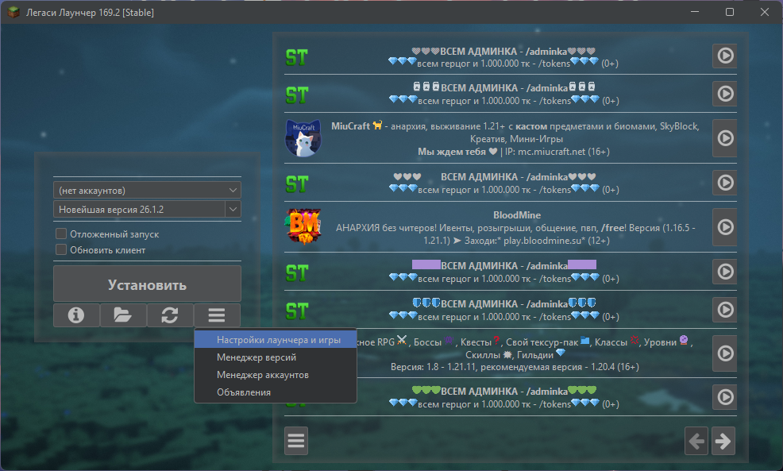

В пункте "Папка игры" выберите "Отдельная папка для каждой версии"
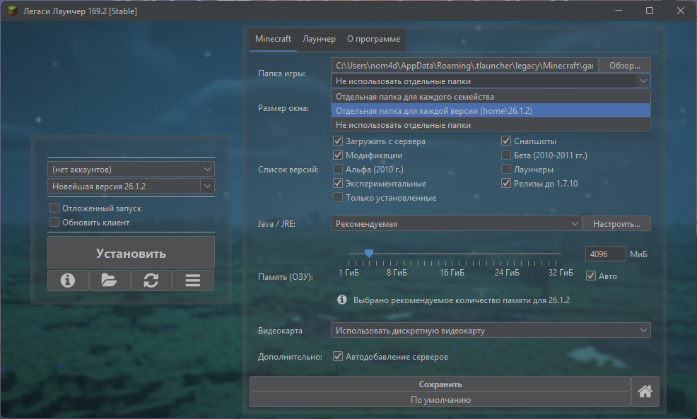

(Опционально) Для удобства выберите "Только установленные" в пункте "Список версий"
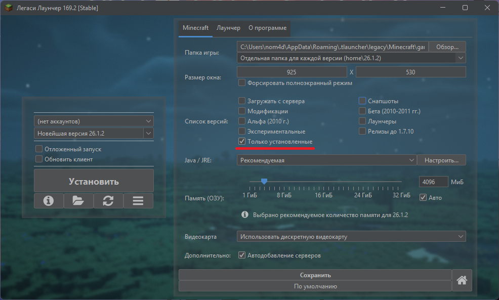

Отключите "Автодобавление серверов" в пункте "Дополнительно" и нажмите "Сохранить"
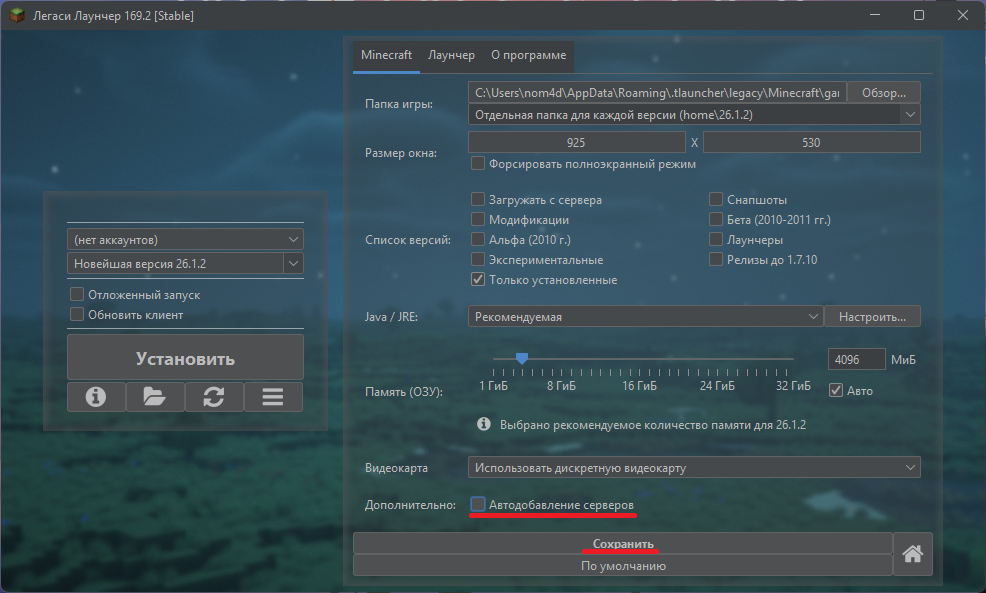

(Опционально) Для очистки лаунчера от визуального мусора, перейдите в раздел "Лаунчер" и в пункте "Объявления" снимите галочку с "Показывать объявления под формой входа"
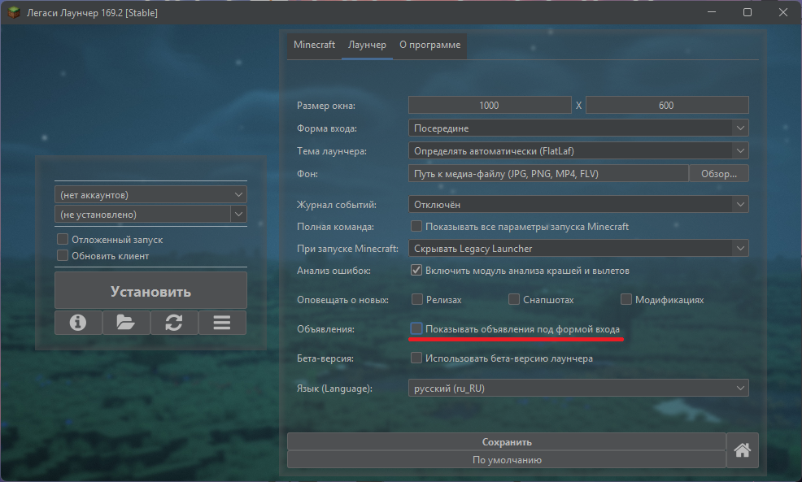

(Опционально) Нажмите на иконку с тремя полосками и выберите пункт "Закрыть панель объявлений"
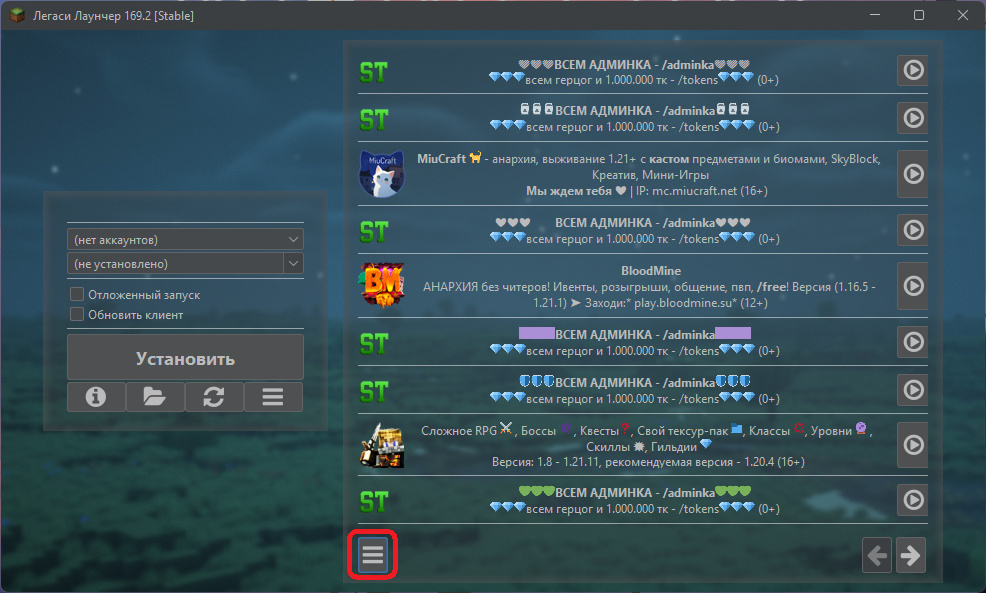
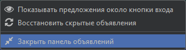

Нажмите на "нет аккаунтов" и выберите пункт "Настроить аккаунты"
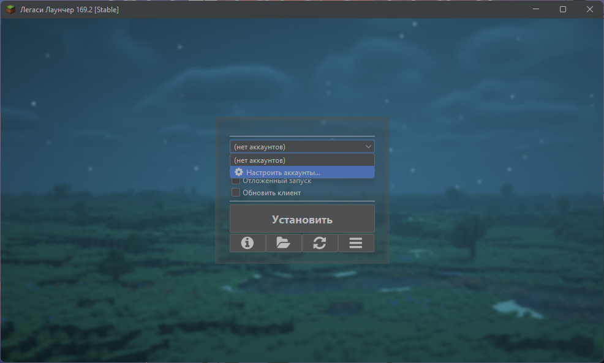

Выберите "Обычный аккаунт" и введите никнейм
(Опционально) Отключите "Использовать скины Ely.by"
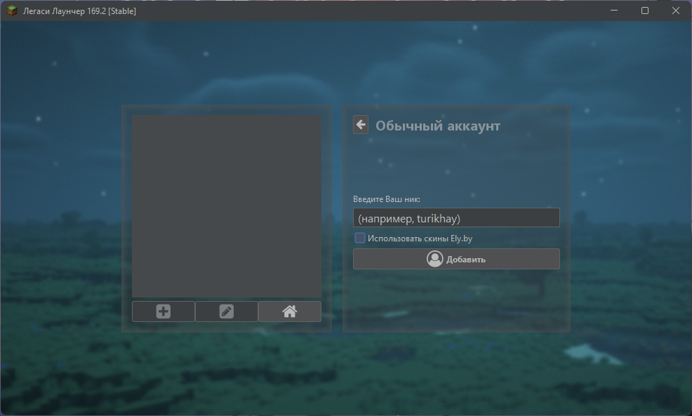

## 3. Установка сборки

Нажмите на кнопку с иконкой "папки"
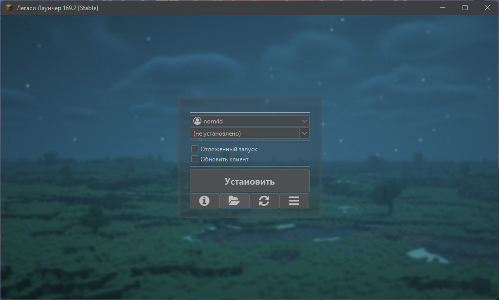

Перенесите папки assets, home, libraries и versions в папку game (полный путь: C:\Users\<user>\AppData\Roaming\.tlauncher\legacy\Minecraft\game), согласитесь с заменой файлов, если потребуется
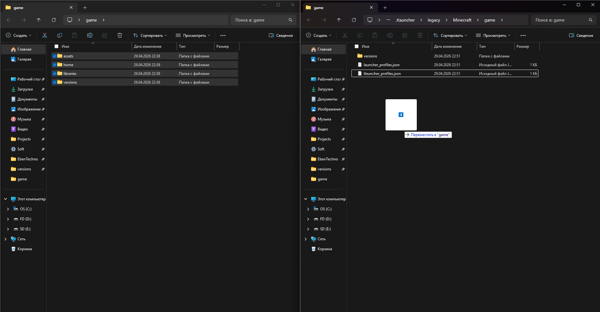

В лаунчере нажмите кнопку "Запрос версий"
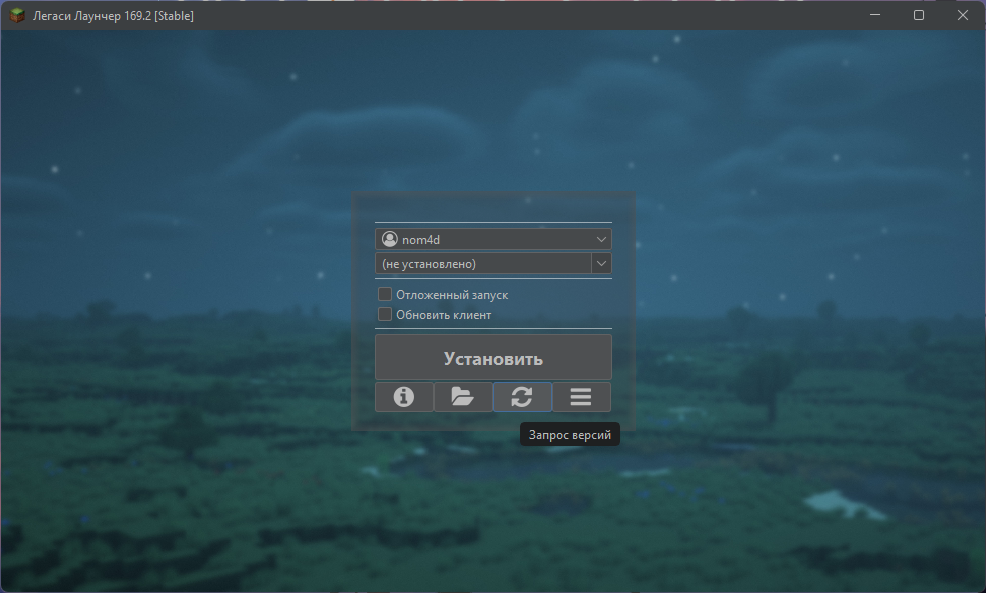

Автоматически будет выбрана версия EbenTechno, нажмите "Запустить"
